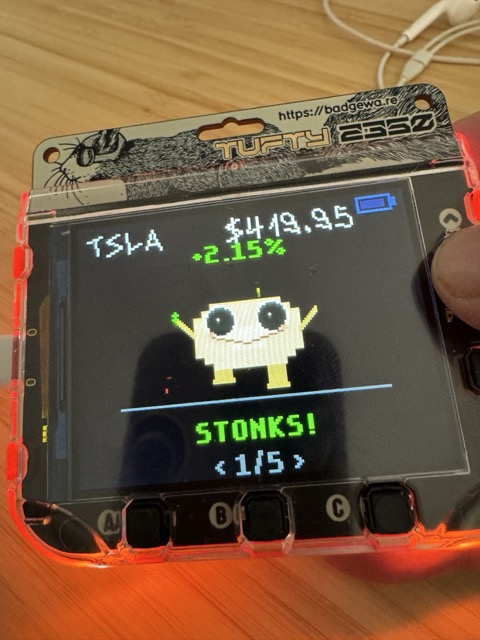
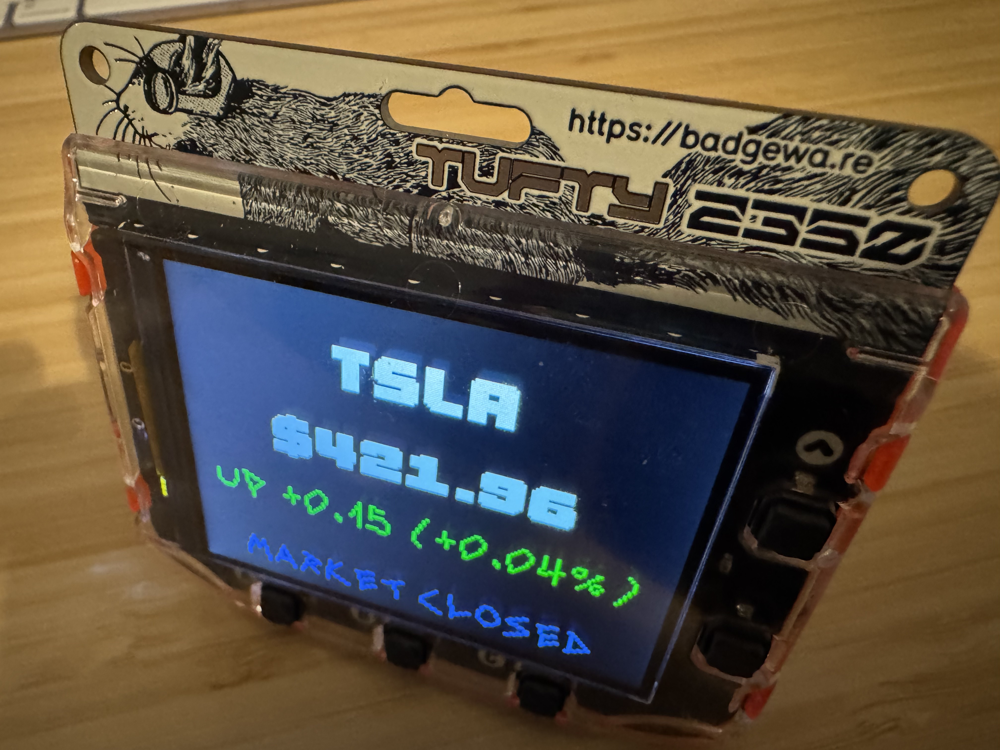

# Tufty 2350<!-- omit in toc -->

Tufty — a glorious blend of everything you love about Badger, now with a vibrant full-colour display and silky-smooth animation.
Perfect for mini dashboards, fast-paced games, and eye-catching widgets.

Get your very own Tufty from [https://shop.pimoroni.com/products/tufty-2350](https://shop.pimoroni.com/products/tufty-2350)

**About This Fork**

This is a variant of the Tufty 2350 Badgeware, customized for US users with US-focused apps and regional settings. And apps for any region (customizable). Importantly, the 'dev' has no idea what he's doing. So YMMV, and YOLO.


## Specs

* 2.8" 320×240 Full-colour IPS display
* RP2350 + 16MB flash + 8MB PSRAM
* WiFi + Bluetooth 5.2
* USB-C + 1,000mAh battery
* User + system buttons
* Four-zone rear lighting
* "Sciuridae Consultant" lanyard

## Meet The Badgeware Family

* [Badger](https://github.com/pimoroni/badger2350) - 2.7" 264×176 greyscale e-paper
* [Blinky](https://github.com/pimoroni/blinky2350) - 872 pixel LED display
* [Tufty](https://github.com/pimoroni/tufty2350) - 2.8" 320×240 full-colour IPS LCD

More details at [https://badgewa.re](https://badgewa.re)

## Help

### Stockpets App

A silly way to keep an eye on your tickers. Most code borrowed from the Stocks App below.




### Stocks App

A real-time US stock ticker for your badge. Track your favorite stocks with a glanceable display that's perfect for conferences, your desk, or just flexing your portfolio.



#### Features

- **Real-time prices** from Finnhub API (free tier)
- **Market status** indicator (Open, Closed, Pre-Market, After Hours, Holidays)
- **Smart refresh** — fetches only when needed, respects API limits
- **Multiple display sizes** — cycle through 4 sizes from readable to GARGANTUAN
- **Offline fallback** — works with cached/mock data if WiFi unavailable
- **Battery-friendly** — slower refresh when market is closed

#### Quick Start

1. Get a free API key from [Finnhub](https://finnhub.io/) (60 calls/min free tier)
2. Connect badge to computer, double-tap RESET to enter disk mode
3. Copy any of the apps folders into your own device's apps folder.  https://github.com/gbgbgb8/tufty2350/tree/main/firmware/apps 

4. Edit `secrets.py`:

```python
WIFI_SSID = "YourNetwork"
WIFI_PASSWORD = "YourPassword"
FINNHUB_KEY = "your_finnhub_api_key"
TIMEZONE = -8  # Your UTC offset (e.g., -8 for Pacific, -5 for Eastern)
STOCKS = ["TSLA", "PLTR", "SPY", "QQQ"]  # Your stock symbols
```

5. Safely unmount and reboot

#### Controls

| Button | Action |
|--------|--------|
| **UP** | Previous stock |
| **DOWN** | Next stock |
| **A** | Cycle display size (Large → Larger → Even Larger → GARGANTUAN) |
| **B** | System info screen (WiFi, IP, battery, market status) |

#### Display Modes

Press **A** to cycle through display sizes:

1. **Large** (default) — Ticker, price, change %, market status
2. **Larger** — Bigger ticker, all info visible
3. **Even Larger** — Giant ticker and price, no market status
4. **GARGANTUAN** — Massive ticker, price at bottom, nothing else

#### Smart Refresh System

The app uses intelligent refresh logic to stay responsive while conserving battery and API calls:

| Data Age | Market Open | Market Closed | Action |
|----------|-------------|---------------|--------|
| < 1 minute | Fresh | Fresh | No fetch needed |
| 1-5 minutes | OK | OK | Display cached |
| > 5 minutes | Stale | — | Fetch with indicator |
| > 15 minutes | — | Stale | Fetch with indicator |

**Background refresh**: Non-displayed stocks refresh once per minute (one at a time) to stay reasonably current when you switch.

**Startup sequence**: Shows splash screen with progress bar while fetching initial data for all stocks.

#### Status Indicators

- **"refreshing..."** — Currently fetching new data
- **"! retry soon"** — Last fetch failed, will retry automatically
- **Pulsing price** — Market is closed (after hours animation)
- **Pulsing background** — Market is open (green=up, red=down)

#### API Usage

With default settings (4 stocks):
- Startup: ~5 API calls (market status + 4 stocks)
- Running: ~1-2 calls/minute average
- Well under Finnhub's 60 calls/min free tier limit

#### Troubleshooting

**"! retry soon" showing?**
- Check WiFi connection (press B for system info)
- Verify API key in secrets.py
- Finnhub may be temporarily unavailable

**Prices not updating?**
- Data younger than 1 minute won't refresh (by design)
- Market closed? Refresh interval increases to 15 minutes
- Check "Updated: Xs ago" on info screen (B button)

**Wrong market hours?**
- Set `TIMEZONE` in secrets.py to your UTC offset
- Example: Pacific = -8, Eastern = -5, UTC = 0


---

## Changelog

### v0.3 - Smart Refresh Update
- **Splash screen** with progress bar during startup
- **Smart refresh logic** — only fetches when data is stale
- **Background fetching** — non-displayed stocks refresh gradually
- **Market-aware timing** — slower refresh when market closed (15 min vs 5 min)
- **Fresh data protection** — won't refetch data less than 1 minute old
- **Error indicators** — shows "! retry soon" on fetch failures
- **Responsive UI** — buttons always work, even during fetches

### v0.2 - Display Improvements
- **4 display sizes** — cycle with A button
- **Removed corner indicators** — cleaner layout
- **Market status at bottom** — better visual hierarchy
- **Vector-free rendering** — uses pixel fonts only for compatibility

### v0.1 - Initial Release
- Basic stock display with Finnhub API
- Market status from API
- WiFi connectivity
- Navigation between stocks
